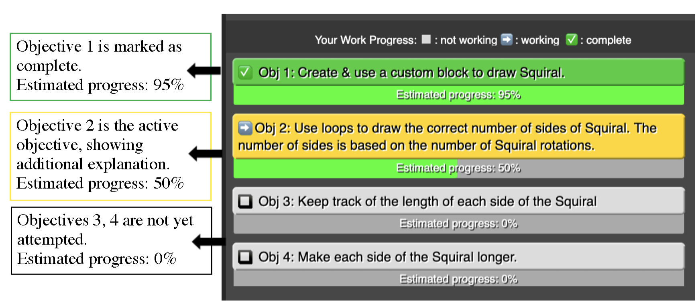
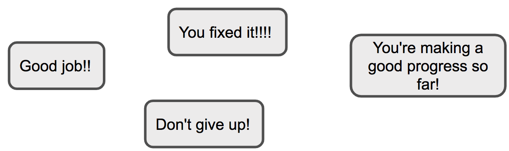

# Overview
The Adaptive Immediate Feedback (AIF) system extends Snap! block-based programming environment to provide feedback that is corrective, specific, immediate, and positive. The AIF evolved through different versions. The most recent one is the AIF 3.0 system that augments Snap! with three main components: (a) a subgoal list, which breaks down the current programming task requirements into 3-5 smaller task objectives. (b) pop-up messages, which provide students with encouraging messages based on their progress (e.g. Good job!). (c) a hybrid data-driven subgoal detector algorithm which generates the list of subgoals, and detects students' progress on them in real time, driving the feedback in the subgoal list and the pop-up messages. The figure below shows an example of the overall AIF system. A demo for the AIF system is available at: <a href="https://go.ncsu.edu/aif2021">The AIF System Demo.</a> 

# The Subgoal List

Below is an example of a subgoal list of Squiral programming task. Each subgoal presents a short, hand-authored label, similar to the task instructions. Initially, each subgoal background is colored grey to indicate that none of the subgoals have been attempted. Students can interact with the subgoal list in two ways. First, they can click on a subgoal to highlight it in yellow and get more information, as shown in Subgoal 2 (i.e. obj2) below. Second, students can double-click on a subgoal to mark it as complete (as shown in `obj 1' below).

The subgoal list adapts to students' code edits by providing feedback on students' progress on each subgoal in real time. Below each subgoal presents a progress bar to show how far students have progressed toward completing that subgoal, as shown in the figure below. This provides students with immediate, specific, corrective, and positive feedback on each edit they make to their code, by showing how that code edit increased or decreased the estimated progress toward a correct solution.

# The Pop-up Messages
The AIF system provides additional positive feedback to students in the form of messages that praise students when they complete a subgoal or fix a broken subgoal, or motivate them when they spend long time without progress. We designed these messages by asking undergraduate students to construct messages to say to their friend with they complete a subgoal, or when they are struggling. While student is coding, the AIF system keeps track of their progress and provide them with a message based on their code actions. The below figure shows examples of the postive feedback messages.

# The Hybrid Data-Driven Subgoal Detection Algorithm

The AIF system generates its feedback by applying a hybrid model that combines a data-driven feature detection model refined with expert constraints to detect the completion of subgoals from student code. We present and evaluated this hybrid model in [Just a Few Expert Constraints can Help, Marwan et al. EDM 2021].

# Evolution of the AIF System
The AIF project has produced various papers. The first version of the AIF system is published in ICER 2020 conference. The second version of the AIF system uses a purely data-driven algorithm to generate subgoal feedback and has been published in CSEDM workshop in 2020. The hybrid data-driven subgoal detector algorithm that is used in the last version of the AIF system is introduced and evaluated in paper published in EDM 2021, and this paper has won the best paper award. The last version of the AIF system (AIF 3.0) provides an empirical classroom study to evaluate its impact on students in real classroom is submitted to the transactions of learning technology (TLT).