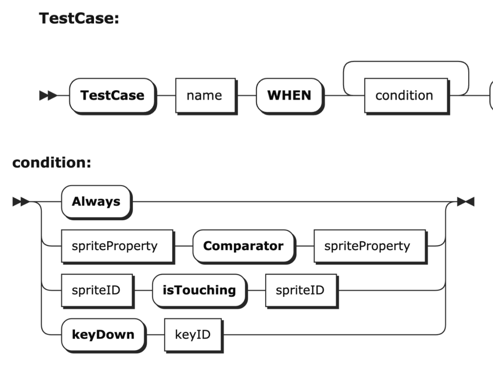
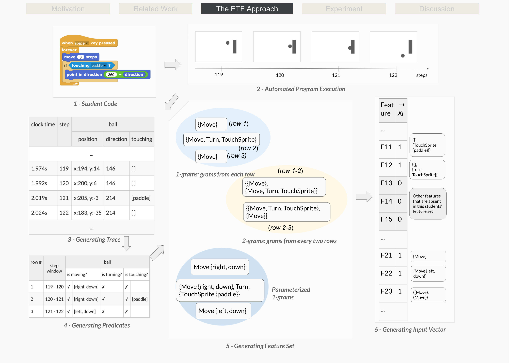

# Overview

Open-ended programming projects (and even traditional programming assignments in block-based programming environments) are difficult to assess. This is because they are often visual and interactive, meaning they cannot be assessed with traditional unit tests, which use simple input/output pairs. In this project, we explore novel ways to assess students' visual, interactive programming projects using dynamic analysis. 

### SnapCheck

In this work, we created a novel, automated system for assessing visual, interactive programming assignments. We developed the first functional-test-based automated assessment framework for Snap, called SnapCheck, which can assess these visual, interactive programs, using a defined rubric. To define this rubric, instructors or researchers must define Weinterface, by specifying WHEN and THEN conditions (e.g., WHEN actor 1 touches actor 2, THEN actor 1 changes direction). This tool was evaluated in an experiment with 162 programming projects students completed in Snap on a Pong assignment. [The result is published in ITiCSE 2021](https://emmableu.github.io/publications/wang2021snapcheck.pdf). 

### Execution-Trace-Based Feature Engineering

While SnapCheck allowed instructors to author test cases using a simple authoring language, it still required instructors’ authoring effort. To automatically assess student programs with no manual authorizations, we developed a data-driven assessment algorithm, leveraging a novel feature engineering method called ETF (Execution-Trace-Based Feature Engineering). The ETF approach automatically assesses student programs using prior graded submissions from prior students. The feature engineering approach uses the runtime behavior (execution trace) of student programs, rather than the code itself, to generate features used to predict its grade. Wang evaluated the ETF approach in a dataset with the same 162 programming projects students completed in Snap on a Pong assignment. [The result is published in the CSEDM workshop at EDM 2020](https://emmableu.github.io/publications/wang2021execution.pdf), showing the the ETF approach outperformed existing syntax-based methods by 15%.