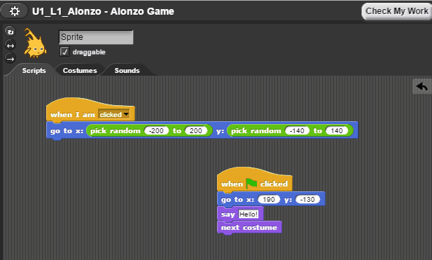

# Overview

[Snap](http://snap.berkeley.edu) is an online, bock-based programming environment designed by researchers at UC Berkeley to make programming more accessible to novices. iSnap augments the environment with intelligent features including logging and data-driven hints.

iSnap is a project out of the HINTS lab in collaboartion with the [Game2Learn](http://eliza.csc.ncsu.edu) lab at North Carolina State University, with lead development by [Thomas Price](go.ncsu.edu/twprice). A public mirror of iSnap is available on [GitHub](https://github.com/thomaswp/iSnap), but it may be behind the development branch demoed here until features are ready for release.

The iSnap project has also produced various papers and public datasets, which can be found [below](#datasets).

The construction of a Snap program and the corresponding evaluation.

### Data-driven Hints

<!--  -->

Using data collected from real students working on programming assignments, we are able to generate on-demand, next-step hints for students who get stuck on these assignments. The _SourceCheck_ algorithm matches students' code to previously observed code from students who successfully completed the assignment and recommends an edit based on how those students progressed.

<!--  -->

See an explanation of iSnap's help features below, or try them out yourself at the [iSnap demo](go.ncsu.edu/isnap). Select any assignment and test out the hints.

When a student needs help, they can ask iSnap to check their work. To start off, it shows two colors:

*   Blocks that are highlighted in magenta probably don't belong in a solution.
*   Blocks that are highlighted in yellow probably do belong in the solution, but may not be in the right place.

Hovering over a yellow-highlighted block will show where it can be moved.

If a student requests a next-step hint, iSnap also adds:

*   Blue + buttons and input outlines   indicating where new blocks can be inserted

Clicking a button or highlighted input will show a next-step hint, comparing a student's current code to iSnap's suggested code. If the suggestion is followed, the button or input outline disappears, indicating the student has successfully followed the hint.

#### Previous Version of iSnap Hints

The above demo shows off iSnap's newest hint interface, but much of the earlier research with iSnap used a simpler hint interface, based on the [Contextual Tree Decomposition (CTD)](http://www4.ncsu.edu/~twprice/website/files/EDM%202016.pdf) algorithm. See a demo of these hint in action by completing the [Guessing Game Part 1](snap-old.html?assignment=guess1Lab). The assignment asks you to create a guessing game, in which the computer stores a random number and then repeated asks the player to guess it, telling them if they are too high, too low or correct.

When a student is stuck, they can request a hint with the click of a button.

Students can request hints about whole scripts or individual blocks.

### Logging

iSnap logs all actions taken by students in the environment, as well as snapshots of students' code as they work. Logs can be saved to a database for future analysis, review or grading. To get a quick overview of the programs that have been created on this demo site, check out the [viewer page](logging/view/).  

**Note**: this is a demo site and does not include actual student data.

iSnap offers a basic interface to navigate and view the logs it generates.

### Papers and Datasets

For all iSnap-related papers, see a [filtered list of publications](../../tag/isnap/).

For more information on the data-driven algorithm that powers iSnap, see: 

* 
* 
* 
* 

For more information on iSnap and its initial pilot evaluation, see: 

* 
* 
* 

The iSnap project has also produced public datasets, consisting of log data from students working in an introductory computing class, which can be found on the [PSLC Datashop](https://pslcdatashop.web.cmu.edu/Project?id=321).