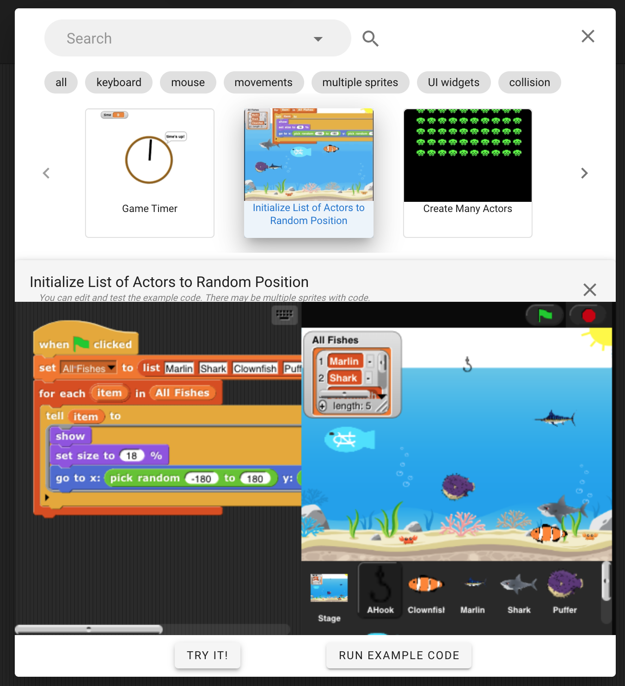

# Overview
Open-ended programming engages students by connecting computing with their real-world experience and personal interest. However, such open-ended programming tasks can be challenging, as they require students to implement features that they may be unfamiliar with. We explore different ways to support students making creative, open-ended programming projects.

## Code Examples
### Example Helper
#### The Prototype Version

We first developed a prototype of the "Example Helper" system to help students learn through examples how to make open-ended projects. The Example Helper allows students to browse a curated set of code examples, represented as short animations (gifs).  When students select a code example, they can view the code for the example, next to their own project code. They are prompted to write a self-explanation and copy the example code to their own code by dragging it directly to their own code.

#### Novices' Learning Barriers When Using Code Examples
We deployed the prototype interface to CS0 course students in the Fall 2020 semester, when students were working on the open-ended programming project during the second month of the course. The goal of the study was to identify students’ learning barriers when using code examples during open-ended programming.  We found the following 3 types of learning barriers students encounter:

-   Decision barriers. Students can be reluctant to open the example gallery to request help, even when they are stuck in implementing a certain feature.
-   Search barrier: when students try to search for examples they need when programming, they may not know how to express the exact example behavior they want to view.
-   Integration barrier: When students try to use an example in their own code, they may encounter difficulties to integrate the examples into their own context. We found that 4 different low-level difficulties caused students to encounter the integration barrier:
	-   Understanding barrier: difficulties to understand an unfamiliar code block;
	-   Mapping barrier: difficulties to map a property in an example code to a property in their own code;
	-   Testing barrier: difficulties to test an example immediately when viewing it;
	-   Modification barrier: difficulties to modify an example to use it in their own project.

#### The Fully Remodeled Example Helper

Based on the barriers we identified from the Fall 2020 CS0 study, we developed a second version of Example Helper (Example Helper V2) to overcome these barriers. The new interface included specific features such as example previews, auto-completion searches, and example playground to allow students to browse, search and test an example easily, specifically to address the decision, search, and integration barriers. We deployed Example Helper V2 with CS0 class students in Spring 2021, conducted log data analysis to the data collected during the study, and compared the data collected with data from the previous semester (Fall 20). The study has the following findings:

-   Example Helper reduced students' search barrier, as the auto-complete suggestions allowed over 80% searches returned results, about twice the percentage of student search queries that returned results from the prototype version.
-   Example Helper reduced students' decision barriers, as an average student who used the Example Helper opened the gallery approximately 16.8 times, higher than the average of 5.67 times from Fall 2020 using the prototype version.
-   Example Helper also reduced students’ integration barriers, as an average student who opened examples in Example Helper has integrated approximately 1.65 examples in their final project submission, higher than the average of 0.7 examples from Fall 2020.

