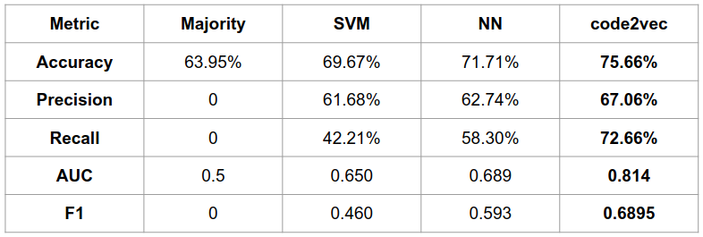

# Overview

Student modeling in HintsLab is a project led by [Yang Shi](http://yshi.info/), across different domains mainly including machine learning assisted automatic student code analysis. We leverage state-of-the-art machine learning and deep learning technologies to analyze student prgramming traces, to fulfill various educational applications, including student bug detection, analysis, and knowlegdge tracing.

### Student Bug Detection

Through the code submissions by students, with out prior knowledge of the typical bugs from students, we are able to autmatically discover similar patterns of errors, using the clustered latent embeddings of a trained code2vec neural network (see [code2vec page](https://code2vec.org/)).

We use the student programming data from a relatively complicated project in an introductory student programming course. The network uses correctness of the code submissions as the label, and achieved a relatively higher auto-grading performance than other machine learning methods such as support vector machine and neural networks. 

With each point represents a two-dimensional latent embedding from a student code submission, the detected clusters are colored differently to show different error types. In this image below, we have brown-colored code submissions misusing not required code blocks, green-colored submissions lacking a knowledge of loop, and orange-colored submissions missing defined variables.

When bug information from a similar dataset is available, we are able to perform more precise detections on the bugs. We further leverage an another deep learning model, ASTNN, and use semi-supervised learning to improve the performance of the bug detection task, showing that with the help of semi-supervised strategy, deep learning models are able to perform better in the detection tasks for three types of common student bugs. The comparison of the solid lines (semi-supervised strategy) and the dashed lines (supervised strategy) shows that extra unlabeled data would enable the improvement, although the current accuracy is not yet ready for classrooms when available labeled data is limited.

### Student Progress Prediction

One key to the success of hinting students is to see when/if a hint, or interference is needed. We predict the progress of students using the already written code with machine learning tools, to check if students will struggle in a future similar task. This research is on-going now.

### Knowledge Tracing

Tracking students' knowledge on certain areas have been one major topic for student modeling. There are models such as Deep knowledge tracing (DKT, [see original paper](https://stanford.edu/~cpiech/bio/papers/deepKnowledgeTracing.pdf)), while it has not been specifically designed for computer science classes. With student code available for tracing, combining this information in would help a more accurate tracing.

Our experiment gives an attempt on applying DKT and simple feature extraction methods such as TF-IDF to student code in the knowledge tracing task. The experiment shows that the features from code improve the performance.

### Papers and Datasets

For all related papers, see the list at the bottom of this page.

The dataset access of the 2021 CSEDM data challenge can be found on [CSEDM data challenge website](https://sites.google.com/ncsu.edu/csedm-dc-2021/home).

For more information on student bug detection and analysis, see: 

* 
* 

For more information on Knowledge Tracing, see: 

* 
